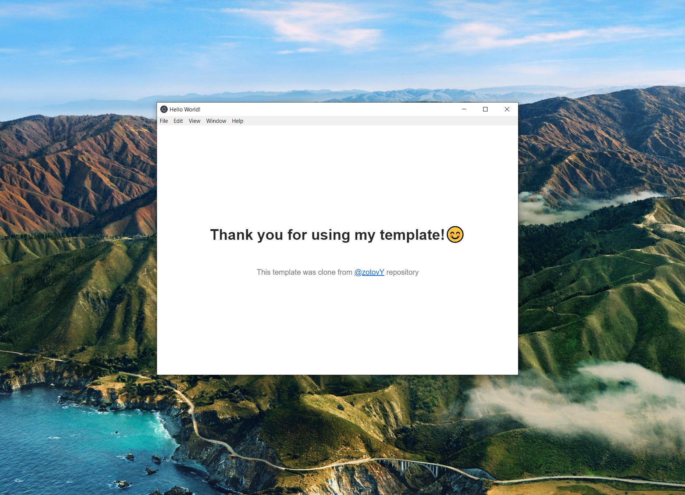

# Electron, React, Typescript & Webpack boilerplate

This is powerful boilerplate for cross-platform development with [Electron](https://www.electronjs.org/), [React](https://reactjs.org/), [Typescript](https://www.typescriptlang.org/) and [Webpack](https://webpack.js.org/). Killer feature of this boilerplate is 100% working dev mode which will reload your app every time you save the file.



### Get started

Clone this repository

```
git clone https://github.com/zotovY/electron-react-ts-webpack-boilerplate.git
```

edit the following fields in package.json for your own project

```
{
  "name": your-project-name,
  "version": whatever-you-like,
  "description": your-own-description,
  "build": {
    "appId": your-app-id,
    "productName": your-product-name,
    "buildVersion": whatever-you-like
  },
  "author": who's-the-author?,
  "license": if-you-don't-want-to-use-MIT,
  "repository": type-and-link-of-your-repo,
  "keywords": keywords-of-your-project,
  "bugs": issue-page-of-your-repo,
  "homepage": homepage-of-your-repo
}
```

install all dependencies

```
npm install
```

### Running

running without live reload

```
npm run start
```

running with live reload in dev mode

```
npm run dev
```

### Building

The boilerplate is currently configured to package & build the installer of your app for macOS & Windows using `electron-builder`.

build for mac os

```
npm run build:mac
```

build for windows

```
npm run build:windows
```

_** `asar` archiving is disabled by default in Windows build as it can cause errors while running the installed Electron app based on pervious experiences, whereas the macOS build with `asar` enabled works just fine. You can turn it back on by removing line 23 (`"asar": false`) in `package.json`. **_

### Extra options

The build scripts are pre-configured to build 64 bit installers since 64 bit should be the standard for a modern applications. 32 bit builds are still possible by changing the build scripts in `package.json` as below:

```
// from
"scripts": {
    ...
    "build:win": "electron-builder build --win --x64",
    "build:mac": "electron-builder build --mac --x64"
},

// to
"scripts": {
    ...
    "build:win": "electron-builder build --win --ia32",
    // Works only on macOS version < 10.15
    "build:mac": "electron-builder build --mac --ia32"
},
```

Builds for Linux, armv71, and arm64 can also be configured by modifying the build scripts in `package.json`, but those aren't tested yet. For details, please refer to [documents of `electron-builder`](https://www.electron.build/cli).

## Folder structure

```
electron-react-typescript-base-proj/
| - dist/               //- Generated by Webpack automatically
| - node_modules/
| - out/                //- Generated by build script automatically
| - public/             //- Global static assets
| | - index.html
| | - style.css
| - src/
| | - main/             //- Backend modules for the Electron app
| | | - main.ts         //- Entry point of 'electron-main'
| | - models/
| | - renderer/         //- Frontend React components for the Electron app
| | | - renderer.tsx    //- Entry point of 'electron-renderer'
| | - utils/            //- Common utilities
| - test/               //- Unit tests
| - .eslintrc           //- ESLint config
| - .gitignore
| - package-lock.json
| - package.json
| - tsconfig.json       //- TypeScript config
| - tslint.json         //- TSLint config
| - webpack.config.js   //- Webpack config
```

## Author

[Wing Chau](https://github.com/iamWing) [@Devtography](https://github.com/Devtography) & [Zotov Yaroslav](https://github.com/zotovY)

## [](https://github.com/Devtography/electron-react-typescript-webpack-boilerplate#license)License

Electron React TypeScript Webpack Boilerplate is open source software [licensed as MIT](https://github.com/Devtography/electron-react-typescript-webpack-boilerplate/blob/master/LICENSE).
